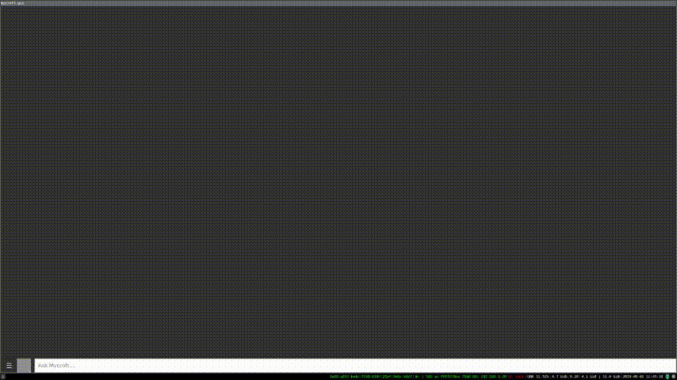

# Stability AI Skill

## About

A skill for the OpenVoiceOS system, enabling queries to [Stability AI](https://stability.ai)
for generation of figures using one of its stable diffusion models:

* SDXL v1.0 (`sdxl_v1.0`)
* SD v1.6 (`sd_v1.6`)
* SD Beta (`sd_beta`)

Powered by the [Stability AI API lib](https://github.com/femelo/stability-ai-api).

The figure is shown in the GUI.



## Configuration

Under skill settings you can tweak some parameters for Stabilit AI API.

| Option          | Value                                                                  | Description                                                   |
| --------------- | ---------------------------------------------------------------------- | ---------------------------------------                       |
| `api_key`       | `your-stability-ai-api-key`                                            | Your `API key` to query Stability AI                          |
| `model`         | `sdxl_v1.0`                                                            | Model (`sdxl_v1.0`, `sd_v1.6`, `sd_beta`)                     |
| `style_preset`  | `fantasy-art`                                                          | Style preset (e.g., `photographic`, `pixel-art`)              |
| `confirmation`  | `true`                                                                 | Spoken confirmation                                           |

Read more about the parameters in the [Stability AI API reference](https://platform.stability.ai/docs/api-reference).

## Configuration file

The skill utilizes the `~/.config/mycroft/skills/skill-ovos-stability-ai.femelo/settings.json` file which allows you to configure it.

### Configuration for the skill

```json
{
  "api_key": "{your-stability-ai-api-key}",
  "model": "sdxl_v1.0",
  "style_preset": "fantasy-art",
  "__mycroft_skill_firstrun": false
}
```

## Examples

* "Draw me a figure of a cat dancing valsa"
* "Generate a picture of a car falling from a tree"
* "Ask Stability AI to paint a robot with sunglasses"

## Category

Generative AI

## Tags

\#generative-ai
\#stable-diffusion
\#question
\#query
